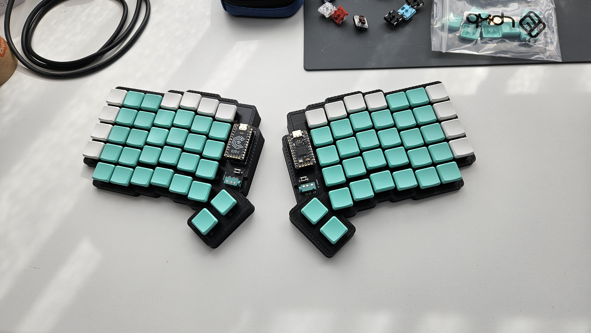

# JONKEY

The JONKEY is a columnar split keyboard created using [ergogen](https://github.com/ergogen/ergogen).

## Project Contents
- Ergogen Config: [jonkey.yml](v1/jonkey.yml)
- PCB Design: [v1/pcbs/v1.1/](v1/pcbs/v1.1/)
- 3D Printable case: [case/](v1/case/)
  - The newest version has a 5 degree slope and tighter tolerances
    - [Left](v1/case/Case%20-%20Left%20-%205deg.stl)
    - [Right](v1/case/Case%20-%20Right%20-%205deg.stl)
- QMK Config: [qmk_config/](v1/qmk_config/)

## Notes
- The PCB is a single reversible board, flip it over for the right side
- The Pro Micros need to be attached upside down on the left and right side up on the right for the correct pin alignments
- Currently the QMK firmware has the side hardcoded and needs to be complied individually for each side. To switch between compiling the left/right side firmware, uncomment the appropriate line in the [config.h](v1/qmk_config/atomicjon/jonkey/config.h) (Lines 16/17)
  - There are free pins (D2, D3) that could be used for high/low indication of side
